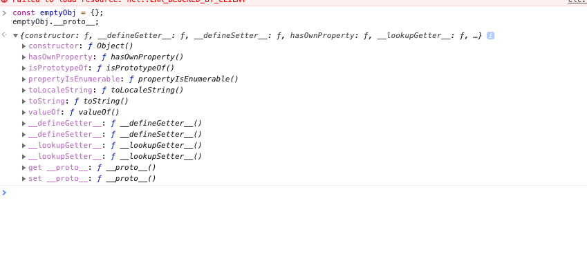

# Lesson 3 - Objects

Objects are a common... object in JavaScript. Basically an object is a collection of data. 

for example we might define an object like: 

```javascript
const student = {
    name: "bob", 
    age: 12, 
    favoriteColor: "red"
}; 
```

Those values `name`, `age`, `favouriteColor` are known as object _properties_ and behave just like variables. 

You can access an object's properties by using the `.` character. 

For example: 


```javascript
console.log(student.age); //12
```

An object can contain many levels of nesting: 

```javascript
const teacher = {
    name: "caroline", 
    age: 55, 
    address: {
        street: "Kings Place", 
        number: 55, 
        city: "Janeville"
    }
}

console.log(teacher.address.city);
```

Note that while objects typically contain 'data like' values like strings, numbers, other objects, just like variables they can also be functions. 

```javascript
    const somePerson = {
        name: "Danielle", 
        favoriteColor: "red", 
        favoriteFood: "apples", 
        getProfile: () => {
            return "My name is " + this.name + " my favorite food is " + this.favoriteFood + " and my favorite color is " + this.favoriteColor"; 
        }
    }

```

Here we are using a keyword called `this`, where from the function we are able to reference the object that the function belongs to. 

I don't like the `this` keyword and I recommend never using unless you have a very good reason for it. However, I need to mention it, because it will become relevant in the next lesson - Arrays. 

To call a function that exists on an object, you access it via the `.` and call the function with the round brackets `()`. 

```javascript
const personProfile = somePerson.getProfile();
```

## Object mutation 

Until now I've been very reluctant to mention variable reassignment and object mutation, but I figure let's mention this here, only to say 'We aren't doing this'. 

You will likely see this kind of thing in other code examples, etc, so I might as well acknowledge that it exists. 

We can change the properties of an array by _reassigning_ them. 

For example: 

```javascript

const myObj = {
    value: 1
}; 
console.log(myObj) //{value: 1}

myObj.value = 2; 

console.log(myObj); //{value: 2}

```

Doing this kind of operation is called _object mutation_, and it can lead to confusing behaviour. 


As an example: 

```javascript
const initalObject = {
    name: "name", 
    value: 1
};

function useObject(obj) {
    obj.value = obj.value + 1; 
    console.log("Object's value is: " + obj.value)
    return obj; 
}


console.log(initalObject); //{ name: "name", value: 1 }
useObject(initalObject);  //Object's value is: 2
console.log(initalObject); //{ name: "name", value: 2 }

```

Here we can see that when we passed the value into the `useObject` function, the function changed it. On a larger code base, it can be hard to understand what and where is changing your object. 

Instead - I prefer to use an non-mutative style of programming, where instead of changing an object, we create copies of the object and change that. 

## Copying objects 

For the above example we can achieve the same kind of functionality like this: 

```javascript
const initalObject2 = {
    name: "name2", 
    value: 1
};

function useObject2(obj) {
    const newObject = {
        ...obj, 
        value: obj.value + 1
    }; 
    console.log("Object's value is: " + newObject.value); 
    return newObject; 
}

console.log(initalObject2); //{ name: "name", value: 1 }
const newObject = useObject2(initalObject2);  //Object's value is: 2
console.log(initalObject2); //{ name: "name", value: 1 }
console.log(newObject); //{ name: "name", value: 2 }
```

That `...` is called a _spread operator_. Basically it assigns all of the properties of the old object, onto the new object. 

In this case, we then assign `value` over top the old `value property` because it occurs later on. 

Were we to change the code to: 

```javascript
    const newObject = {
        value: obj.value + 1
        ...obj, 
    }; 
```

Then the new object would have a `value` of `1`. 

## Merging objects

The spread operator can be used to merge two objects together: 

```javascript
const valueA = {
    a: 1, 
    b: 2, 
}
const valueB = {
    c: 3, 
    d: 4
}; 

const valueC = {
    ...valueA, 
    ...valueB,
}; 

console.log(valueC); //{ a: 1, b: 2, c: 3, d: 4 }
```


## Object equality 

It's now time to talk about composite values and primitive values. 

Primitives are are the atomic building blocks of JavaScript. The common primitives, that you will now already be familiar with are: 


- string
- number
- boolean
- null
- undefined 

(There are two more, which I've never used - [see the documentation here](https://developer.mozilla.org/en-US/docs/Glossary/Primitive). 

Primatives can never be mutated, like in the we did with the object earlier.


Everything else is a composite object, it can be mutated. 

This becomes important we we talk about object equality. 

Say I do something like this: 

```javascript
const objA = {
    value: 1
}; 

const objB = {
    value: 1
}; 

const objectsAreEqual = objA === objectB; 
console.log(objectsAreEqual);

```

What do you think the output of this code is? `true`? 

Nope! It's false. 

The reason is, when we are doing an equality operation, we are not checking that 'the two objects contain the exact same values' - we are checking that _they are the same value_. 

To explain this watch this video: 

https://www.youtube.com/watch?v=IX3fDYz0WyM

The point to highlight is that while primitive values are directly stored 'on the stack' as such, with objects we store _just a pointer to that object_ on the stack. When we do a `===` comparrison, we are comparing the values that are on the stack, not the objects themselves. 

## Object prototype 

Oh boy! We're really getting into the weeds here. Should really call this series _Advanced JavaScript_. 

All objects have a _prototype_. You can access the prototype via the `__proto__` property. 

**For this exercise, we need to use the browser**. 

(The reason we need to use the browser, is because the NodeJS runtime doesn't have a convenient way of printing the prototype). 

Open your browser, press F12 and then in console type 

```javascript
const emptyObj = {}; 
emptyObj.__proto__; 
``` 

You will see a prototype like: 



We can see that the object has some functions like `toString` and `hasOwnProperty`. We don't need to use these now, or anytime in a forseeable future, but just know that they are there. 


Note that the `__proto__` property uses underscores (`_`). This doesn't do anything special, in JavaScript the underscore is just another character like letters are, but as a convention underscores, and especially double underscores  are used to mean 'be careful with this thing, we don't want you accidently changing this'. 

The reason I'm mentioning prototypes here, is because in the next lesson, Arrays, arrays have functions that live on the prototype, in case you were wondering where they came from. 

## Conclusion 

Objects are convenient way to group data together. 


## Exercise

Navigate to this directory (`lesson-103-objects`) in your terminal. 

Install required dependencies with `yarn`.

Start the tests running with `yarn start` (or `yarn start:windows` if you are using Windows). 

Implement the functions in `src/exercise.js` such that the tests pass. You can examine the tests  in `src/exercise.test.js` to see what the functions should do. 


 

