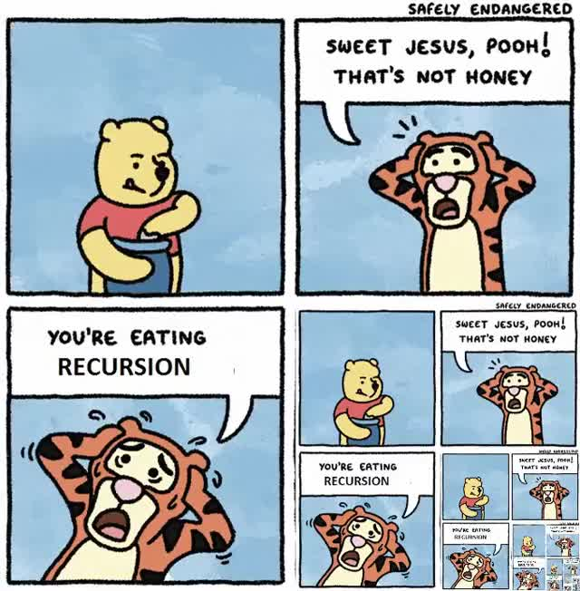

# Lesson 116 - Recursion 

Recursion is when a function calls itself. If you are not careful this can cause a your program to run infinitely. 



 This can be be a useful technique when you need to traverse a data structure or accumulate a result until an end condition is met. 

## Simple Recursion example 


```javascript
function myFirstRecursiveFunction(currentValue, endValue) {
  // This is what is known as the 'base case' - it's the case that will stop calling the recursion
  if (currentValue === endValue) {
    return;
  } 
  else {
    console.log('Current value is', currentValue);
    // This is the recursion - we are calling the function again, this time increasing the number by one.
    myFirstRecursiveFunction(currentValue + 1, endValue);
  }
}

myFirstRecursiveFunction(0, 10);

```

This function by itself is not particularly interesting, we could have easily have achieved the same functionality with a loop like we saw earlier: 

```javascript
new Array(10).fill(true).forEach((v,i) => {
    console.log("Current value is ", i); 
})
```

## Creating a factorial function 

A more realistic scenario where recursion is useful is in implementing a factorial function. 

In math notation the exclamation mark `!` is used. `4! = 4 * 3 *2 * 1 = 24`. Note that `0! = 1`; 

The way we would create a function that works this out is: 

```javascript
function factorial(n) {

    // For the purposes of this exercise we will just say that the factorial of any negative numbers will also be 1.

    // The base case(s):
    // 0 = 1
    // 1 = 1 
    if (n < 2) {
        return 1; 
    }

    else {
        return n * factorial(n -1); 
    }
    
}


console.log(factorial(0)); //1
console.log(factorial(1)); //1
console.log(factorial(2)); //2
console.log(factorial(3)); //6
console.log(factorial(4)); //24
 
```

Let's think about what's happening here: 

For the case where we call `factorial(0)` - well n is less that 2, so we return 1. Simple. 

For the case where we call `factorial(2)` - n is not less than 2, so now: 

- We call `factorial(2-1)`, this returns 1. 
- We return 2 * 1 = 2. 

## Exercise - Fibonacci sequence

The fibonacci sequence is one that that goes: 

> 1, 1, 2, 3, 5, 8, 13, 21

That is - the next number in the sequence is generated by adding the two previous numbers. The first two numbers in the sequence are 1 and 1. 

Implement the fibonacci function. 

Navigate to this directory (`lesson-116-recursion`) in your terminal. 

Install required dependencies with `yarn`.

Start the tests running with `yarn start` (or `yarn start:windows` if you are using Windows). 

Implement the function in `src/exercise.js` such that the tests pass. You can examine the tests  in `src/exercise.test.js` to see what the function should do. 


 

