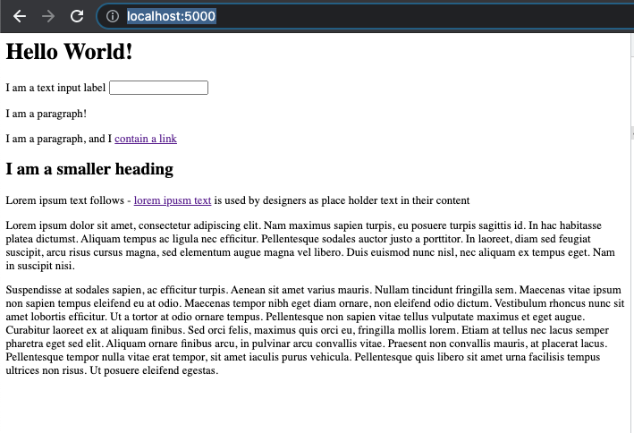

# Introduction to HTML 

Ok, so now that you're starting to get the hang of JavaScript, let's completely switch track and start learning HTML (Hypertext MarkUp Language). 

I want you to imagine, if you can what the internet was like in the early 90s. 

No streaming video, no chat windows in the right hand corner, no hovering links to see a preview of the content. 

Basically just linked (hyperlinked!) pages of content, and forms to submit. 

That's where we are going to start. 

## Syntax

HTML isn't so much a _programming_ language as a _document_ language. 

That is - with HTML we are not giving the computer a set of instructions to go off and execute - we are _writing a document_. 

HTML makes use of angle bracket tags, here is an example HTML document: 

```html
<html lang="en">

<head>

</head>

<body>
    <h1>Hello World!</h1>
    <label> I am a text input label <input type="text" /> </label>
    <p>I am a paragraph!</p>

    <p> I am a paragraph, and I <a href="https://github.com/dwjohnston/javascript-101">contain a link</a></p>

    <h2>I am a smaller heading</h2>

    <p>Lorem ipsum text follows - <a href="https://www.lipsum.com/">lorem ipusm
            text</a> is used by designers as place holder text in their content</p>

    <a> Lorem ipsum dolor sit amet, consectetur adipiscing elit. Nam maximus sapien turpis, eu posuere turpis sagittis
        id. In hac habitasse platea dictumst. Aliquam tempus ac ligula nec efficitur. Pellentesque sodales auctor justo
        a porttitor. In laoreet, diam sed feugiat suscipit, arcu risus cursus magna, sed elementum augue magna vel
        libero. Duis euismod nunc nisl, nec aliquam ex tempus eget. Nam in suscipit nisi.</a>

    <p>
        Suspendisse at sodales sapien, ac efficitur turpis. Aenean sit amet varius mauris. Nullam tincidunt fringilla
        sem. Maecenas vitae ipsum non sapien tempus eleifend eu at odio. Maecenas tempor nibh eget diam ornare, non
        eleifend odio dictum. Vestibulum rhoncus nunc sit amet lobortis efficitur. Ut a tortor at odio ornare tempus.
        Pellentesque non sapien vitae tellus vulputate maximus et eget augue. Curabitur laoreet ex at aliquam finibus.
        Sed orci felis, maximus quis orci eu, fringilla mollis lorem. Etiam at tellus nec lacus semper pharetra eget sed
        elit. Aliquam ornare finibus arcu, in pulvinar arcu convallis vitae. Praesent non convallis mauris, at placerat
        lacus. Pellentesque tempor nulla vitae erat tempor, sit amet iaculis purus vehicula. Pellentesque quis libero
        sit amet urna facilisis tempus ultrices non risus. Ut posuere eleifend egestas.
    </p>

</body>

</html>
```


## Exercise 1

Navigate to this directory (`lesson-130-introduction-to-html`) in your terminal. 

Install the dependencies with `yarn`. 

Start the exercise with `yarn start`. 

You should see a message like: 

```
   ┌────────────────────────────────────────┐
   │                                        │
   │   Serving!                             │
   │                                        │
   │   Local:  http://localhost:5000        │
   │                                        │
   │   Copied local address to clipboard!   │
   │                                        │
   └────────────────────────────────────────┘
```

Copy that address and paste it into your browser window. 

You should see our first webpage!




## The Inspector

Press `F12` to open the developer tools. 

Press the inspector button at the top left of the developer tools. 


Now mouse over the 'Hello World!' text. 

Note that it highlights. 

When you click it, note that the HTML tag is highlighted in the Elements pane. 

Get comfortable with using the inspector, for the rest of the lesson you can examine the tags in the document, and how they look within the browser window. 

## Anatomy of a tag

An HTML tag typically has three parts: 

- The opening and closing tags 

For example, we have an opening tag: `<h1>`, followed by whatever content is _inside_ that that tag, and then a _closing_ tag to indicate the end of that element `</h1>`. 

Tags can be  _self closing like `<input/>` - where we are saying that is an element by it self, with no content inside of it. 


- Attributes

The attributes apply to the opening tag only. They are additional properties you are passing to the tag, that change how it behaves. You can think of them like arguments you would pass to a function. 

For example the link in the above code has a `href` attribute: 

```html
<a href="https://github.com/dwjohnston/javascript-101">
```

The `href` (Hypertext REFerence) attribute tells the tag what URL to link to. 
## This looks kind of plain

You're right! I told you to imagine we were going back to the internet of the early 90s 😉

What you are seeing is purely unstyled HTML. We can style the HTML with a technology called CSS (Cascading Style Sheets), which we will get onto in a later lesson. 

## Kinds of HTML tags. 

Navigate to `http://localhost:5000/exercise2`

The code that is used in the rest of the lesson is displayed here. 

Because it might not be immediately apparent which element is which, I've added a little bit of CSS to add a dotted border around the elements I'm talking about. However, I would encourage you to use the inspector to highlight them yourself. 

There are a lot of HTML tags, [here's a good list](https://developer.mozilla.org/en-US/docs/Web/HTML/Element) we are going to quickly cover some of more commonly used ones here, but for an indepth look at how to use the tags correctly, that page is going to do a better job than me, and infact I'm just going to be regurgitating what I read there. 

### Headings - h1, h2, h3,h4,h5,h6

The heading tags denote a page heading, and sub headings. 

The `<h1>` tag is largest, and there should only be one on a page. 

The following tags denote the next most important section. 

```html
    <h1>I am H1</h1>
    <h2>I am H2</h2>
    <h3>I am H3</h3>
    <h4>I am H4</h4>
    <h5>I am H5</h5>
    <h6>I am H6</h6>
```

### Text - p, span, strong

The `<p>` tag is used to create paragraphs. 

Note that the `<p>` tag naturally gives spacing, called _margin_ above and below it. 

```html
    <p> I am a paragraph!</p>
    <p> I am another paragraph!</p>

    <p><span>I am a span inside a paragraph!</span> I am text that isn't in a span </p>
    <p><span> I am a very long span. Notice how I wrap, but I don't create a box like a p does. Suspendisse at sodales sapien, ac efficitur turpis. Aenean sit amet varius mauris. Nullam tincidunt fringilla
        sem. Maecenas vitae ipsum non sapien tempus eleifend eu at odio. Maecenas tempor nibh eget diam ornare, non
        eleifend odio dictum. Vestibulum rhoncus nunc sit amet lobortis efficitur. Span ends here.</span> I am text that isn't in a span </p>

    <p><strong>I am strong text</strong></p>
```

The `<span>` tag is an _inline_ element, think of it as 'words within a paragraph'. 

The `<strong>` tag is like a span, but in browsers it typically applies a bold font. 


### Links - a

The `<a>` tag (['a' for anchor](https://stackoverflow.com/questions/39434659/what-does-the-a-in-the-html-a-tag-stand-for), if you wondering) creates a link. 

We covered it earlier, but `<a>` tag is usually used with the `href` attribution, which tells the browser which URL to visit when the tag is clicked. 

### Layout components - div, article, section, 

The `<div>` `<article>`  all _visually_ behave the the same way - they are just a way of grouping some content. 

```html
    <div> 
        <p>I am a paragraph inside a div</p>
    </div>
    <article> 
        <p>I am a paragraph inside an article</p>
    </article>
```

So why are there three different tags that do the same thing? The answer is _semantic HTML_. 

Semantic HTML is the concept that as developers we try to write our HTML in a way that makes readable sense. 

That is - while visually on a broswer they may look exactly the same, they do not have the same behaviour for: 

 - Someone using a screen reader to read your page
 - A computer, (such as a Google webcrawler) reading your page. 
 - The HTML reads differently to a developer reading the HTML - that is - I would expect that the content inside an `<article>` would contain a the main body of text, and not say, a user profile card. 


### Tables - table, tr, td, thead, th

Tables were one of the very first elements to be created in HTML - it makes sense - they're very useful for displaying data. 

```html
    <table> 
        <thead>

            <tr>
                <th>Name</th>
                <th>Age</th>
                <th>Favourite Color</th>
            </tr>
        </thead>
        <tbody>
            <tr>
                <td>Andy</td>
                <td>11</td>
                <td>Red</td>
            </tr>
            <tr>
                <td>Belinda With A Very Long Name</td>
                <td>33</td>
                <td>Blue</td>
            </tr>
            <tr>
                <td>Celine</td>
                <td>55</td>
                <td>Orange</td>
            </tr>
        </tbody>

    </table>
```


The HTML here hopefully is fairly self explanatory: 

- `<table>` - the whole table
- `<thead>` - The table head - which is basically header rows. 
- `<tbody>` - The opposite of the table head - it contains the data itself. 
- `<tr>` - Table row 
- `<td>` - Table data - The individual data cell
- `<th>` - Like a `<td>` but for header cells. 

Note that a key useful things about tables is that can keep content aligned with each other - for example in the case where Belinda has a very long name. 

Note that the table comes with it's own default styling - bold and centered in the `<th>` for example. This is all customisable with CSS. 

### Horizontal rule - hr

The `<hr>` tag provides a horizontal rule. I thought I'd mention it given that it is in the example code. 


### Images - img

The `` tag can be used to display an image. 

```html
    
```

We use the `src` tag to tell the browser where to get the image from. The `alt` attribute is for the 'alternate text' - that will be displayed if the image doesn't exist. 

It is also what will be read to a user using a screen reader - so it's important to to include alt attributes to your images. 

In the following snippet I'm intentionally referencing an image that doesn't exist, so you can see the alt text display.

```html
    

```


### Comments - `<!-- -->`


Comments in HTML can be created with `<!-- -->`. Like code comments, they don't do anything, but they can be helpful for the developer. 

```html
<!-- This is a comment -->
```


## Exercise 

- Play around with the html in `src/exercise2.html`. Remember to reload the page between changes. 

