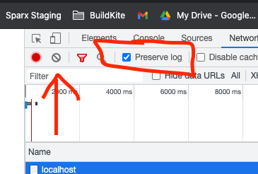

# Forms

In lesson-130 we introduced HTML. With the HTML we introduce there, you could _display_ information, for example, you create a recipe website, or a blog. However, there isn't any way for the user to _interact_ with the website, except for clicking links. 

In this lesson, we are going to introduce _forms_ which allow the user to enter information. 

## Exercise

Navigate to this directory (`lesson-132-forms`) in your terminal. 

Install the dependencies with `yarn`. 

Start the exercise with `yarn start`. 

Note that the referenced code in this lesson is on this page. 

## The <form> element

The `<form>` element tells the browser that everything contained within belongs to a single form. 

A webpage can have multiple forms. 


## Form elements

Most form elements are in the `<input>` tag, but not all. 

### text

The text input allows the user to enter text. 

```html
<input type="text" name ="my-text"/>
```

The `name` attribute provides a key for the data when you submit the form. This will make sense in the next section about submitting forms. 

### text-like inputs

There are other inputs that look the same as a text input, but have built in validation for types like email, or telephone

```html
<input type="number" name ="my-number" />
<input type="email" name ="my-email"/>
<input type="tel" name ="my-tel" />
```

Try entering an invalid email into the email input and submitting the form, and see what happens! 

### Label

Labels allow labelling a form control. Note that when you click a label, it acts as if you clicked the form control!

```html
<label>Name:
    <input type="text" name ="my-text-2"/>
</label>
```

Note that the input sits _inside_ the label. 

### radio button 

Radio buttons allow the user to select _one_ from a list of options. 

The reason it is called a radio button is because it's based on those old push/pop buttons on car radios, where you push one and the others pop out. 

```html
<label>red <input type="radio" name="color" checked value ="red"></label>
<label>blue <input type="radio" name="color"  value ="blue"></label>
<label>green <input type="radio" name="color"  value ="green"></label>
```

Note that we have _four_ attributes here

- `type` - Tells the browser that it is an input of type `radio`
- `name` - Determines a group for the individual control to belong to. ie for a radio button, when you select one radio button, all of the other radio buttons belonging to that group will pop out. 
- `checked` -  tells the browser that this value is initially checked
- `value` - This is the value of the individual button - this will make more sense when we talk about form submission. 
### checkboxes

Checkboxes allow users to select _one or many_, from a list of options. 

```html
<label>red <input type="checkbox" name="color" checked value ="red"></label>
<label>blue <input type="checkbox" name="color" value ="blue"></label>
<label>green <input type="checkbox" name="color" value ="green"></label>
```

Note that similarly the checkbox has the same attributes as the radio button. 


### select

Functionally, a select achives the same purpose as a radio button list, it allows the user to select one of a list of options. 

```html
<select name ="country-of-birth">
    <option value ="australia">Australia</option>
    <option value ="new zealand">New Zealand</option>
    <option value ="sri lanka">Sri Lanka</option>s
</select>
```

A select is often better where there is a _long_ list of options to be selected. 

### submit 

The submit input is a special input that will tell the browser to submit the form. 
 
## Exercise


1. Open the developer tools by pressing `F12`. 
2. Navigate to the 'Network' tab of the developer tools
3. Click 'Preserve Log' - This will prevent the network requests disappearing when we submit the form. 
4. Click the 'clear log' button. 




5. Refresh the page (F5)

6. Note what appears in the network tab: 


On your computer this might look different. Some of these resources are coming from browser extensions for example. 

The important thing is that resource that says 'localhost'. 

Let's click that and explore further: 

The first part says: 

```
Request URL: http://localhost:5000/
Request Method: GET
Status Code: 304 Not Modified
Remote Address: [::1]:5000
Referrer Policy: strict-origin-when-cross-origin
```

Now is a good time to ask: 

### What is a network request? 

Basically what has happened is that when you refreshed the page, your web browser _requested_ data from the server. The server in this instance is a process running on your computer, not a publicly accessible server on the internet. 

We are going to talk about two kinds of network request, GET and POST. 

GET is a request for information. POST is a submission of information. 

So in this case, the first three lines tell us what has happened in this request: 

- The address being requested is `http://localhost:5000/`
- It is a GET request (we are requesting information)
- The response status code is `304 Not Modified` - basically the server saying 'Hasn't changed since you last asked'. 

### Headers

There are two other two sections on this tab, 'Response Headers' and 'Request Headers'. 

Headers are 'metadata' about a request. Information attached to the request and response to tell either the server or the browser about how to handle the request/response. 

For example, the Response has the header: 

```
Content-Type: text/html; charset=utf-8
```

Which tells the browser that the resource is HTML, and not say, and image, which the browser might treat differently. 

We do not need to get any more involved with headers than this, this was more just FYI while we are here. 

Now click to the Response tab. 


Look familiar? 

This is just the entire `index.html` file. Basically the server has transferred to your web browser the entire file, which your browser then renders to the screen. 

### Submitting the form

Submit the form by pressing the submit button on the page. 

Note that now there is a _second_ localhost network request in the log: 


Click the second request, and lets look at the summary: 

```
Request URL: http://localhost:5000/
Request Method: POST
Status Code: 200 OK
Remote Address: [::1]:5000
Referrer Policy: strict-origin-when-cross-origin
```

This time, we have the same request address, but the method is now `POST` we are submitting data. 

Scroll down and see Form Data: 

```
my-text: David
my-number: 123
my-email: foO@bar.com
my-tel: 123123
my-text-2: AAAAA
color: red
pets: fish
country-of-birth: australia
```

Note those keys are the `name` attribute of the form inputs we used!

Two other things to note: 

- The Status code of the response is 200 OK. That's just the server saying 'Yup, got your form submission'. 

- Note that in the Response tab it has just sent the index.html document again. This is because we haven't configured the server to do anything else. 

You now know a bit about how under the hood your browser communicates with a server, and note that browser is either request information from a server, or it is posting information to the server. In either case there is always a request and a response. 


