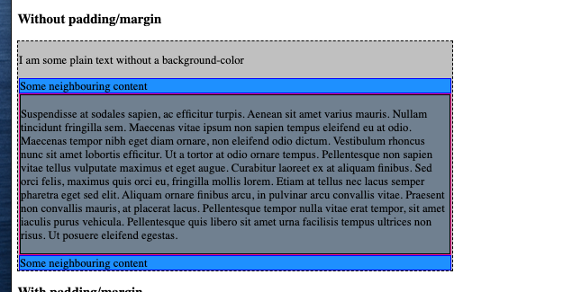
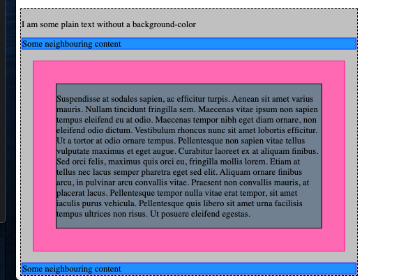

# Introduction to CSS

Remember how I said that the HTML we were writing looks pretty plain, and that we would talk about making it look nice later? 

That time is now - we're talking about CSS (Cascading Style Sheets). 

CSS is a mechanism for applying styling to your HTML. 


## Exercise

Navigate to this directory (`lesson-140-introduction-to-css`) in your terminal. 

Install the dependencies with `yarn`. 

Start the exercise with `yarn start`. 

Note that the referenced code in this lesson is on this page. 

## Styling without CSS

We can style our HTML directly, by using the `style` attribute: 

```html
    <div style="border: dashed 2px blue; border-radius: 10px;">
        <span>i am unstyled text</span>
        <span style="color:red">I am some styled text!</span>
    </div>
```

Note the syntax, we have the css property (`border`) followed by a colon (`:`) followed by the value `dashed 2px blue` ending with a semicolon `;`. Then the next property starts. 

However, imagine we have 100 divs on our page that we wanted to style like this, it would be cumbersome to go through an add style attributes everywhere. Then imagine if we had to change from blue to purple, we would have to go through and change it everywhere!

## Styling with CSS

The first thing we need to do is add a `<style>` tag to the document head (ie inside the `<head>` tag rather than the `<body>` tag). Your CSS will still work if you put it in the body tag, but convention is that we be styles and scripts in the document head. 

We then write our CSS by declaring a _selector_ and then the styles that apply to that selector. eg. 

```css
div {
    border: solid 2px pink; 
}

```

This CSS rule will apply those border styles to all divs. 

```css

div span {
    color: orange;
}
```

This CSS rule will apply the color style to all span tags _inside_ a div. 

## CSS Selectors

In this lesson I am going to explain some of the common CSS selectors, and I'll provider a summary of the others at the end. 

`div` - The styles will apply to all elements of this type

`.this-is-a-class` - Prefixed with a dot means we are targeting a _class_ which I'm yet to mention. 

`#this-is-an-id` - Prefixed with a hash means we are targeting an _id_ which I'm yet to mention. 

`div .my-class` - A space between the selectors means 'inside of', so in this case 'elements with class `.my-class` that are inside of divs' 

`div.my-class` - No space between selectors means 'and', in this case 'divs that have the class `my-class`. 

`div, p` - Commas between selectors mean 'all of these things', in thise case 'all divs and all ps'. 


## Classes and IDs

Classes and IDs are attributes add to HTML elements that identify elements. 

Both IDs and classes should be descriptive - naming _what_ the thing is. 

### IDs

IDs should be _unique_. That is - a document should only ever have one element with id "foo", for example. 

Note though - nothing is going to break if you do use an ID in multiple places - it's one of the things about HTML - even if you do something wrong, forgetting to close a tag for example- it will usually attempt to keep working, but you might get strange behavior. 

However, you should stick to the conventions  - it's much easier when everybody is on the same page. 

Read [here about having multiple elements with the same ID](https://stackoverflow.com/a/44009054/1068446). 

```html
<div id = "user-profile">
    <input id ="username" type ="text"/>
 </div>

```

### Classes 

Classes are similar to IDs except that: 

- An element can have multiple class names
- A class name can be applied to multiple elements. 

Basically - classes are useful for categorizing your content. 

Even if you are not using the class names to apply styles, it can be useful to add them to your HTML regardless - as they help you read the HTML and understand what that section is for. 


This code demonstrates a single class name on the div: 
```html
<div class = "profile-photo-container">
    
</div>
```

This code demonstrates a div with two class names: 

```html
<div class = "profile-photo-container admin-profile-photo-container">
    
</div>
```


## CSS properties 

CSS properties are how we control how the content is rendered, eg text color, text size, border color, style, positioning etc. 

There are a _lot_ of CSS properties. I am not going to try teach you them all, instead, I am going to talk about some of the common ones, and talk more about the fundamentals laying out HTML elements. 

 - `color` - The [color](https://developer.mozilla.org/en-US/docs/Web/CSS/color) property determines the color of the text rendered. The possible color values are available [here](https://developer.mozilla.org/en-US/docs/Web/CSS/color_value). 
 - `font-size` - The [font-size](https://developer.mozilla.org/en-US/docs/Web/CSS/font-size) property determines the size of the text rendered.  For the purposes of this lesson we will be measuring font size in pixels, or `px` in css. 
 - `border `- The [border](https://developer.mozilla.org/en-US/docs/Web/CSS/border) property is shorthand for `border-color`, `border-width` and `border-style` - which control the color, width and style (dashed, solid, dotted etc) of the border of a component. 
 - `background-color` - The [background-color](https://developer.mozilla.org/en-US/docs/Web/CSS/background-color) property determines the background color of an element.  

 - `width` and `height` - Can be used to manually determine the size of an element. This will be useful in some of these examples, but it is often better for an element to determine its own size!


The following examples all have the `.square` class, except for the final one, as well as an additional class

```html
<div class ="square colored">

</div>
<div class ="square font-sized">
    
</div>
<div class ="square bordered">
    
</div>
<div class ="square background-colored">
    
</div>
<div class ="square">
        I have a little text 
</div>
<div class ="square">
    The problem with fixed sizing is that content can overflow and look bad! 
</div>

<div class ="rectangle-no-fixed-height">
    This element has fixed width, but no fixed height, and so the parent just expands to fit the content. 
</div>
```

```css

.square {
    width: 100px; 
    height: 100px; 
}

.colored {
    color: pink; 
}

.font-sized {
    font-size: 20px; 
}

.background-colored {
    background-color: pink; 
}

.rectangle-no-fixed-height {
    width: 100;
}
```

### Value types

Note that there is often multiple ways a value can be expressed in CSS. 


#### Hex codes (color)
For example, a color has a set of string like colors that can be used `red` `yellow` `pink` etc. 

The other common way to represent colors is with a _hexcode_. For example the hexcode for red is #ff0000. 

(Btw, I recommend installing the (something) VSCode plugin that will show the color of the hexcode in your code). 

The way hexcodes work, is that they are a hash (`#`) followed by hexidemical numbers (0-9, a-f). Basically hexidecimal is _base 16_ counting. 

Why base-16? Isn't that unneceserily complicated? 

It's because 16 is 2^4 - ie. a hexidecimal character is actually a  _more convenient_ way to represent a string of 4 binary digits.

In a color hexcode, the first two digits represent 'the amount of red', the next two represent 'the amount of green', and the next two represent 'the amount of blue'. This is what we call an RGB value. 

So #ff0000 means 256 units of red (the maximum), 0 green, 0 blue. 

How would we make purple? #ff00ff - Gives us a magenta. Lowering the amount of red and blue might gives us a more royal purple #6600bb. 

There are otherways we can represent color to, for example the rgba format `rgba(255,0,0, 0.5)` - is similar to hexcodes, where the first three values represent red,green, blue. The final value represents _opacity_ and is a value from 0, 1. It represent show transparent or opaque the color is. 


### Padding and Margin

Two important concepts in CSS are padding and margin. 

Margin refers to empty space _around_ an element. ie. ensuring the element has does not touch its immediate neighbors. 

Padding refers to empty space _inside_ an element, ie ensuring that the content is not hard up against the elements borders. 

Here's how we are going to demonstrate this: 

```html
<div class="dashed-container">
    <p>I am some plain text without a background-color</p>
    <div class="a-neighbouring-element">Some neighbouring content</div>
    <div class="subject-element">
        <div class="inside-content">
            <p>Suspendisse at sodales sapien, ac efficitur turpis. Aenean sit amet varius mauris. Nullam tincidunt
                fringilla
                sem. Maecenas vitae ipsum non sapien tempus eleifend eu at odio. Maecenas tempor nibh eget diam
                ornare, non
                eleifend odio dictum. Vestibulum rhoncus nunc sit amet lobortis efficitur. Ut a tortor at odio
                ornare tempus.
                Pellentesque non sapien vitae tellus vulputate maximus et eget augue. Curabitur laoreet ex at
                aliquam finibus.
                Sed orci felis, maximus quis orci eu, fringilla mollis lorem. Etiam at tellus nec lacus semper
                pharetra eget sed
                elit. Aliquam ornare finibus arcu, in pulvinar arcu convallis vitae. Praesent non convallis mauris,
                at placerat
                lacus. Pellentesque tempor nulla vitae erat tempor, sit amet iaculis purus vehicula. Pellentesque
                quis libero
                sit amet urna facilisis tempus ultrices non risus. Ut posuere eleifend egestas.
            </p>
        </div>
    </div>
    <div class="a-neighbouring-element">Some neighbouring content</div>
</div>
```

In this example, it is the div with the class name `subject-element` that we are interested in. 

The `dashed-container` is just going show a black dashed border, and a light grey background. It'll also be 600px wide just so we can constrain the content for demonstration purposes.

The elements `a-neighbouring-element` will be colored blue. 

The `subject-element` will be colored pink. The `inside-content` will be colored dark grey.  

So this is all pretty straight forward: 

```css
.dashed-container {
    background-color: silver; 
    border: dashed 2px black; 

    width: 600px; 
}

.a-neighbouring-element {
    background-color: dodgerblue;
    border: solid 1px blue; 
}

.subject-element {
    background-color: hotpink;
    border: solid 1px deeppink;
}

.inside-content {
    border: solid 1px black; 
    background-color: slategrey; 
    
}

```

I'm also going to create two other classes to add the padding and margin: 


```css
.subject-element-with-padding {
    padding: 40px; 
}

.subject-element-with-margin {
    margin: 20px; 
}
```

So first let's see how this looks without padding: 




And now we add two classes to the subject element to add the padding: 

```html
<div class="subject-element subject-element-with-padding subject-element-with-margin">
        <!-- snip-->
</div>
```



So what's happening here? 

The _margin_ spaces the subject element (the pink one) from both the neighbouring elements, as well as its parent element. In that space we can see the grey background of the parent element. 

The _padding_ spaces the inside content from the subject elements borders - that's where we can see the pink. 

Play around with properties yourself and see what happens. You can even try playing with negative values for margin! (It appears that negative values for padding does nothing). 

Note that many elements, like `<p>` and the `<h1>`, `<h2>` tags, come with default values for margin. 

## Property inheritance

Some CSS properties, typicially properties applying to text,  when applied to a parent element, while apply to all of their children, unless another rule is applied.

```html
<div class ="has-larger-text">
    I am text directly iniside the div

    <p>I am a paragraph, I still have the text rule applied to me</p>

    <p class ="has-smaller-text">My text is overriden by my own style rule</p>

</div>
```

```css

.has-larger-text {
    font-size: 24px; 
    color: purple;
}

.has-smaller-text {
    font-size: 10px;
}

```

In this example the `font-size:24px; color: purple` style applies to the `has-larger-text` element _and all of its children_. 

The element with `has-smaller-text` is one of the `has-larger-text`'s children - but the styles specific to the `.has-smaller-text` rule takes precedence. 


## Exercise


