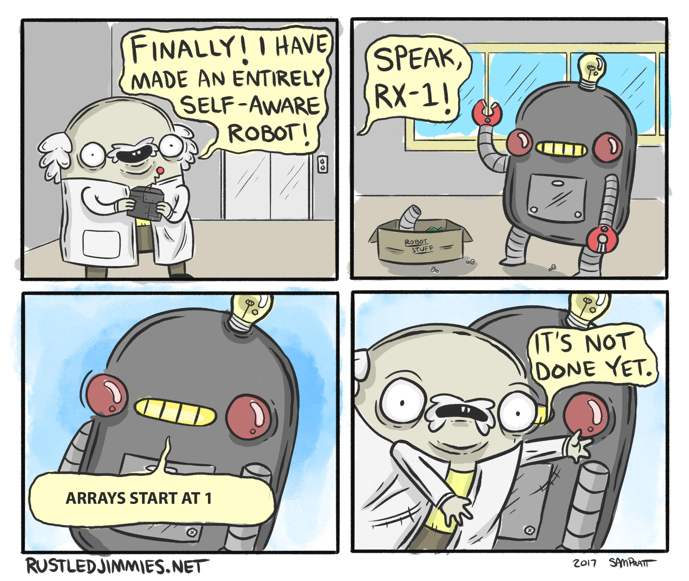
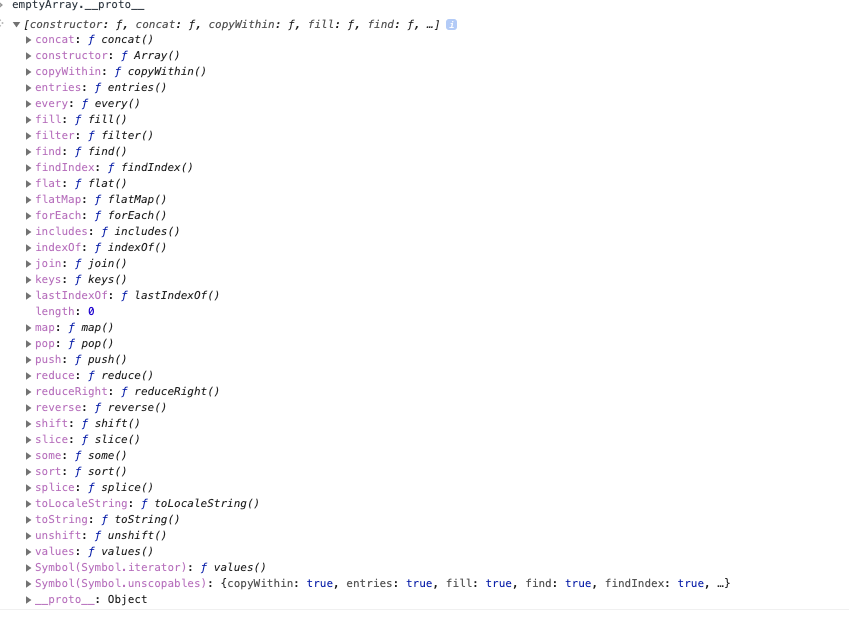

# Lesson 4 - Arrays

Arrays are a common and important data structure in computer science. 

Arrays are basically a list of values. This is useful when you need to deal with a list of anything, a list of users, a list of items in a shopping cart etc. 

## Declaring an array 

We can declare an array using square brackets: 

```javascript
const myFirstArray = [1, 2, 3];
```


In JavaScript an array can include anything kind of value: 

```javascript
const mySecondArray = [
  'foo',
  1,
  {
    hello: 'world!',
  },
  () => 'red',
];
```

Including other arrays!


```javascript
const myThirdArray = [
    [1,2,3], 
    ['a', 'b', 'c']
]
```

An array like this is often called a _two dimensional_ array, and of course you can have three-dimensional, four-dimensional arrays and so forth. 


## Arrays start at 0 

In most, but not all, programming langauges, including JavaScript, the first element on an array has the index position of `0`, not `1` as might be intutive. 

Some languages have made arrays start at 1, and they get mocked: 



## Accessing elements on an array 

We can access the elements on an array using the square brackets: 

```javascript
const letters = ['a', 'b', 'c']; 
const firstLetter = letters[0]; //'a'
const secondLetter = letters[1]; //'b'
```

In JavaScript, if you try access an array position that doesn't exist, you will get an `undefined`

```javascript
const fourthLetter = letters[3]; 
console.log(fourthLetter); //undefined
```

## Array length

You can get the array length with the `.length` property:

```javascript
const arrayLength = letters.length; 
console.log(arrayLength); //3; 
```

Note! The last element with the length - 1! 

```javascript
const lastLetter = letters[arrayLength -1]; 
console.log(lastLetter); //'c'; 
```

🤔 This is where python is nice, in that you can access the last elmeent of an array with `-1` and the second to last with `-2` and so fourth.

## Using multidimensional arrays

Accessing elements on a 2d array is fairly straight forward: 

for example, if we have an array like 

```javascript
const my2dArray = [
    [0, 1, 2], 
    [3, 4, 5], 
    [6, 7, 8]
]; 
```

We just chain the `[]` brackets like so: 

```javascript
const el0 = my2dArray[0][0]; 
const el4 = my2dArray[1][1]; 
const el5 = my2dArray[1][2]; 

console.log(el0, el4, el5); //0 4 5
```

Where the first set of square brackets accesses the outside array, and the second set accesses the inner array. 

## Copying, merging arrays. 

Just like with objects, you can copy and/or merge arrays with the `...` spread operator. 

```javascript
const array1 = [1,2,3]; 
const array2 = [5,6,7]; 

const array3 = [...array1, ...array2]; 
console.log(array3); //[ 1, 2, 3, 5, 6, 7 ]
```


## Array Functions

In JavaScript, arrays are powerful because they come with a bunch of useful methods. 

See the full list here: 

https://developer.mozilla.org/en-US/docs/Web/JavaScript/Reference/Global_Objects/Array#instance_methods

**Nb.** As a matter of course - The MDN documenation tends to be the canonical documentation for JavaScript, it's _very very_ useful and I advise preferring it as reference material over other sources. 

Remember that stuff about prototypes in the last lesson? Well let's look at the prototype of an array: 



There's a whole lot more functions! And note that those are the same functions you will see in the above documentation. 


I won't go through every function, but here are some of the main ones you might want to use: 

### forEach

forEach will execute a function for every element on the array: 


```javascript
letters.forEach((value) => {
    console.log("the value is: " + value)
}); 

// the value is: a
// the value is: b
// the value is: b
```

Let's talk about what we're doing here: 

1. Firstly, we're calling an _object function_ (a function that belongs to and object, in this case the object is the `letters` array). 
2. We pass as the first and only argument, a function: `(value) => {//...}` This is commonly known as a [_lambda_ or _anonymous_ function.](https://en.wikipedia.org/wiki/Anonymous_function#:~:text=In%20computer%20programming%2C%20an%20anonymous,not%20bound%20to%20an%20identifier.). (Unfortunately AWS Lambda functions, which is a service provided by Amazon confuses the terminology a bit 😭 ) 
3. That function has a parameter `value`, that is is going to be the current element as the we iterate over the array. 
4. We print the value. 

Many, but not all, of the array functions work in a manner like this, you pass a function as the argument, and that function will be called for every element in the array. 

### map

Map is perhaps the the most useful array method. 

We can use `.map` to create a new array from the old array. 

For example: 

```javascript
const transformedLetters = letters.map((v) => {
    return "Value: " + v; 
}); 

console.log(transformedLetters); //[ 'Value: a', 'Value: b', 'Value: b' ]
```

In this case we are doing something very similar as the `forEach` example, except in this case we _return_ a value from the lambda function, and these return values are what make up our new array. 


### filter 

Filter does what it sounds like, it filters the array, according to a condition that you define: 

```javascript

const numbers = [1,2,3,4,5]; 

const oddNumbers = numbers.filter((v) => {
    return v%2 === 1; 
}); 

console.log(oddNumbers); //[ 1, 3, 5 ]
```

In this case, the lambda function expects to return a boolean value, and if the value is true, it will include the element in the returned array. 

### find

Find is similar to `filter` but it just returns the first value that fufills the lambda function: 

```javascript
const foundOddNumber = numbers.find((v) => {
    return v%2 === 1; 
}); 

console.log(foundOddNumber); //1
```

### some 

Some will return true if at least one element in the array satisifies the lambda condition: 

```javascript
const someNumbersAreGreaterThanThree = numbers.some((v) => {
    return v > 3; 
}); 

console.log(someNumbersAreGreaterThanThree); //true
```

### every 

Every is like `some` but only returns true if _all_ elements satisfy the lambda condition: 

```javascript
const allNumbersAreGreaterThanThree = numbers.every((v) => {
    return v > 3; 
}); 

console.log(allNumbersAreGreaterThanThree); //false
```

## Exercise

Navigate to this directory (`lesson-4-arrays`) in your terminal. 

Install required dependencies with `yarn`.

Start the tests running with `yarn start` (or `yarn start:windows` if you are using Windows). 

Implement the functions in `src/exercise.js` such that the tests pass. You can examine the tests  in `src/exercise.test.js` to see what the functions should do. 


 

